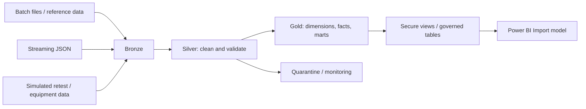

# 📊 SemiconPlus — Semiconductor Manufacturing Lakehouse

End-to-end manufacturing data engineering portfolio built with **Azure Databricks, PySpark, Spark SQL, Delta Lake, Unity Catalog, and Power BI**. Demonstrates batch and streaming ingestion, dimensional modeling, data quality, and governed analytics.

> **Public portfolio:** Manufacturing identifiers are anonymized, and simulation-based retest/equipment datasets are identified separately from source-backed demonstration data. No proprietary manufacturing or customer-sensitive information should be published.

## 🔎 Problem and Engineering Value

Semiconductor analytics combines production lots, unit tests, equipment events, and reference data from different sources. Inconsistent identifiers, test flows, and KPI definitions complicate reliable reporting.

SemiconPlus organizes these datasets into a **Bronze → Silver → Gold lakehouse**, providing reusable manufacturing facts, dimensions, secure serving views, and a three-page Power BI report. This is a portfolio demonstration; quantified production savings are **not** claimed.

## ⚙️ Processing Workflow

1. **Ingest:** Load batch manufacturing/reference files and demonstration streaming JSON events into Bronze Delta tables.
2. **Standardize:** Validate and clean records in Silver, including dedicated handling for late-arriving streaming results.
3. **Model:** Build Gold dimensions, SCD Type 2 device history, yield/retest/equipment facts, and analytical marts.
4. **Validate:** Record data-quality results, ingestion audits, and rejected records in monitoring/quarantine datasets.
5. **Serve:** Expose governed views and Gold tables to a Power BI Import semantic model.
6. **Operate:** Use Databricks pipelines/workflows and operational validation; separately refresh Power BI Import data when required.

**📸 Screenshot to add — Databricks:** Pipeline/workflow overview showing the batch or streaming processing stages. Suggested file: `images/databricks_pipeline.png`.

## 🧩 Data Modeling and Warehousing

SemiconPlus uses an **OLAP-oriented dimensional model** for analytical queries, rather than acting as an OLTP transaction system.

| Concept | SemiconPlus example | Purpose |
| --- | --- | --- |
| **Star schema** | Yield facts linked to conformed date, device, site, product-group, and lot dimensions | Simple, reusable BI filtering and aggregation |
| **Snowflake schema** | Related dimension hierarchies can be normalized across device and product group | Modeling comparison; **not claimed as a separately implemented snowflake model** |
| **Fact tables** | `gold.fact_lot_performance`, `gold.fact_yield_periodic`, `gold.fact_oee_hourly` | Measurements at defined reporting grains |
| **Dimension tables** | `gold.dim_date`, `gold.dim_device`, `gold.dim_site`, `gold.dim_equipment` | Descriptive context for facts |
| **SCD Type 2** | `gold.dim_device_scd2` | Preserve historical versions of device attributes |
| **Analytical marts** | `gold.mart_daily_yield`, `gold.mart_device_yield`, `gold.mart_equipment_oee_daily` | Curated summaries for recurring analysis |

**Modeling decision:** Star-schema-oriented serving simplifies Power BI consumption. A normalized snowflake schema can reduce repeated dimension attributes but adds joins; SemiconPlus does not need to claim both physical models. The current `dim_device` and historical `dim_device_scd2` serve distinct needs.

**📸 Screenshot to add — Databricks:** Unity Catalog lineage for `gold.fact_yield_periodic` or `gold.fact_lot_performance`. Suggested file: `images/databricks_lineage.png`.

**📸 Screenshot to add — Power BI:** Model View showing relationships between fact and dimension tables. Suggested file: `images/powerbi_model.png`.

## ⚡ PySpark and Streaming

- **DataFrames / Spark SQL:** Joins, standardization, aggregation, dimensional transformations, and Delta writes.
- **Structured Streaming / Auto Loader:** JSON ingestion into Bronze and Silver streaming tables.
- **Late-data handling:** Separate `silver.streaming_late_test_results` dataset.
- **Materialized aggregation:** `gold.mart_streaming_yield_5m`.
- **Optimization considerations:** Filter/project early, avoid unnecessary shuffles, inspect join strategies, and measure performance before claiming gains.

**RDDs** and typed **Datasets** are relevant Spark concepts but are **not claimed as separate implemented APIs** in this PySpark portfolio.

**📸 Screenshot to add — Databricks:** Streaming pipeline graph or successful historical run. Suggested file: `images/databricks_streaming.png`.

## 📐 Manufacturing KPI Definitions

| KPI | Project definition |
| --- | --- |
| **FPY** | First-pass passing units ÷ first-pass tested units |
| **FTY** | Final yield after applicable retest flows |
| **RPR** | FTY − FPY (percentage-point recovery) |
| **LRR** | Lots below the FTY target ÷ total eligible lots in the reporting period |
| **OEE** | Availability × Utilization × FTY (project-specific definition) |

Project targets include **FPY ≥ 95%**, **FTY ≥ 98%**, and **OEE ≥ 80%**. These are project rules, not universal semiconductor standards. Final-test metrics depend on successful retest enrichment and should not be inferred from first-pass-only records.

## 📊 Power BI Reporting

The existing report contains **three pages** backed by an **Import** semantic model. It uses secure Databricks dimension/yield/operational views and relevant Gold equipment tables.

| Evidence | Add tomorrow |
| --- | --- |
| Power BI report — Page 1 | `images/powerbi_page_1.png` |
| Power BI report — Page 2 | `images/powerbi_page_2.png` |
| Power BI report — Page 3 | `images/powerbi_page_3.png` |
| Power BI Model View | `images/powerbi_model.png` |

**Refresh limitation:** Import-mode reports require a semantic-model refresh after new Databricks data arrives. Automated Power BI Service refresh is **not claimed as implemented** without a tested integration.

## 🏗️ System Design and Engineering Decisions

| Decision | Rationale / trade-off |
| --- | --- |
| **Azure Databricks + Spark** | Common environment for distributed transformations, pipelines, and analytical tables; requires cloud cost management |
| **Delta Lake + medallion layers** | Separates raw ingestion, quality-controlled records, and analytics-ready outputs; introduces additional storage/processing stages |
| **Batch + streaming** | Supports recurring source files and event-driven demonstrations; streaming adds checkpoint, lateness, and recovery considerations |
| **Star-schema-oriented Gold model** | Reusable BI facts and dimensions; requires clear grain and relationship management |
| **SCD Type 2** | Supports historical device analysis; adds versioning and effective-date complexity |
| **Unity Catalog + secure views** | Separates governed analytical access from underlying datasets; permissions require environment-specific verification |
| **Power BI Import** | Responsive dashboard interactions; requires explicit data refresh |
| **Quality, quarantine, and audit tables** | Improves traceability of invalid inputs and pipeline outcomes; operational checks must be maintained |

**System design discussion:** The primary design challenge is keeping batch and streaming sources reliable while maintaining consistent manufacturing keys, correct KPI grains, and governed reporting. A production-scale deployment would additionally require measured throughput/cost targets, recovery testing, permissions verification, and service-level objectives.

**📸 Screenshot to add — Databricks:** Unity Catalog catalog/schema layout or governance view. Suggested file: `images/databricks_catalog.png`.

## 🧪 Engineering Scope and Limitations

The portfolio demonstrates **ingestion, transformations, data-quality/error handling, dimensional modeling, orchestration, and reporting**. Databricks monitoring, workflow, and quarantine tables exist in the project. Specific performance improvements, fully automated Power BI refresh, and end-to-end CI/CD deployment should only be advertised after verification.

The project contains **source-backed demonstration data**, **synthetic/simulated manufacturing events**, and a **streaming demo**. These are not interchangeable with measured production outcomes.

## 🧰 Technology Stack

**Azure · Databricks · Python · PySpark · Spark SQL · Apache Spark · Delta Lake · Auto Loader · Unity Catalog · Power BI · Git/GitHub**

## 👤 Author

Developed as a Data Engineering portfolio project demonstrating semiconductor manufacturing lakehouse design, PySpark processing, dimensional modeling, governance, and analytical reporting.
